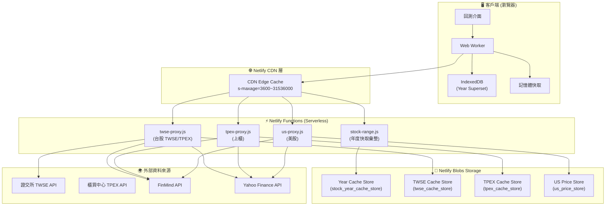
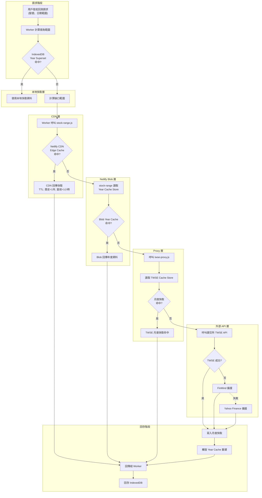
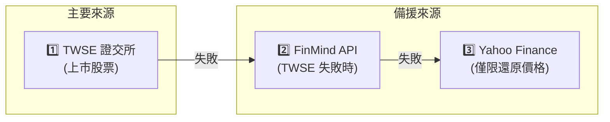
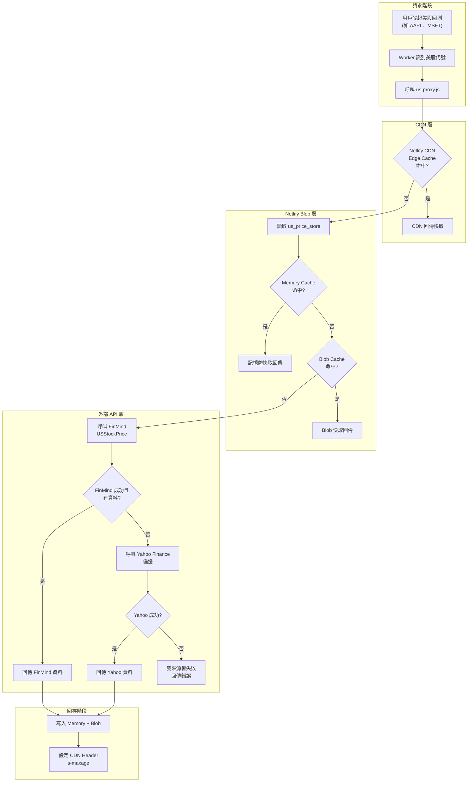
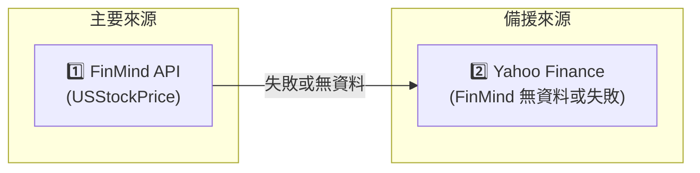
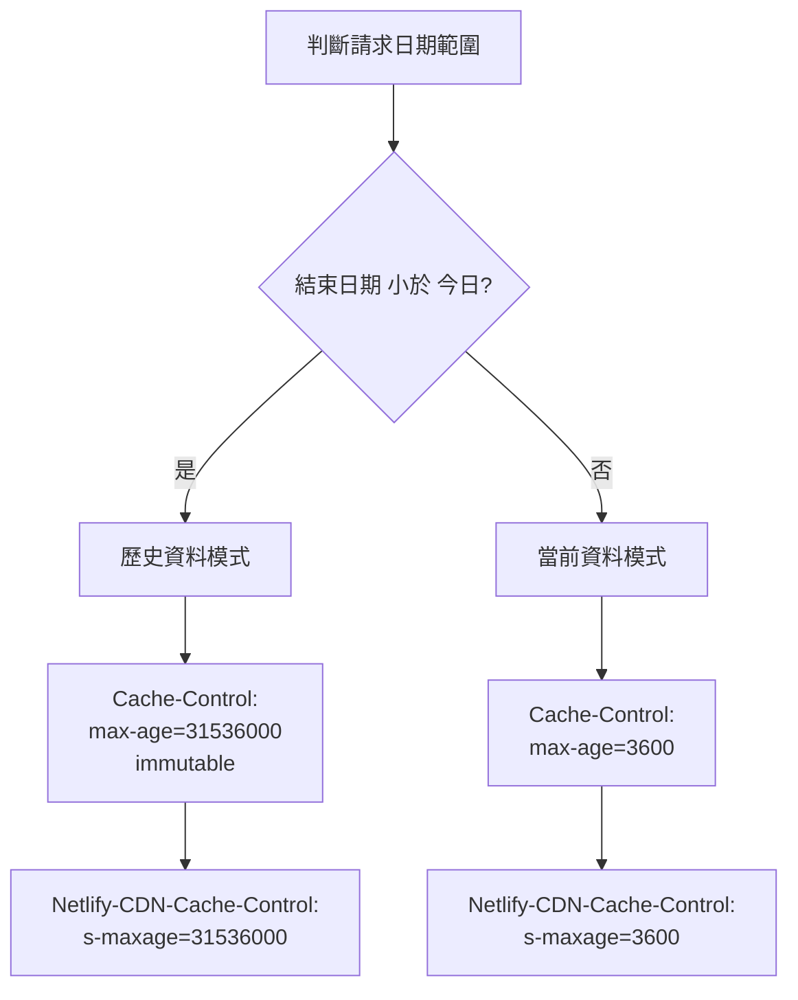
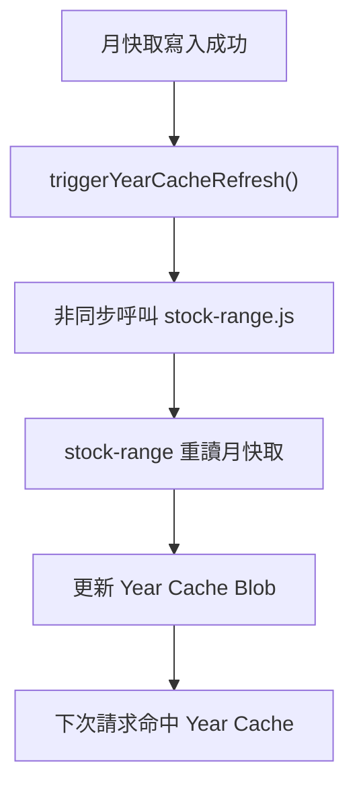

# LazyBacktest CDN 架構與資料流向圖

> **版本**: LB-CDN-ARCH-20251209A
> **目的**: 說明台股與美股的 CDN 功能架構與資料流向

---

## 一、系統架構總覽



---

## 二、台股資料流向圖

### 2.1 台股完整流程圖



### 2.2 台股資料來源優先級



### 2.3 台股快取層級與 TTL

| 快取層級 | 儲存位置 | TTL (存活時間) | 說明 |
|---------|---------|---------------|------|
| **L1: 記憶體快取** | Worker 變數 | 單次回測 | 最快存取，單次請求內有效 |
| **L2: IndexedDB** | 瀏覽器本地 | 永久 (帶版本) | Year Superset，跨回測持久化 |
| **L3: CDN Edge** | Netlify CDN | 歷史=1年, 當前=1hr | CDN 邊緣快取 |
| **L4: Blob Year Cache** | Netlify Blobs | 2-3 天 | 年度彙總資料 |
| **L5: Blob Month Cache** | Netlify Blobs | 24 小時 | 月度原始資料 |

---

## 三、美股資料流向圖

### 3.1 美股完整流程圖



### 3.2 美股資料來源優先級



### 3.3 美股快取層級與 TTL

| 快取層級 | 儲存位置 | TTL (存活時間) | 說明 |
|---------|---------|---------------|------|
| **L1: 記憶體快取** | Function 變數 | 12 小時 | Netlify Function 記憶體 |
| **L2: CDN Edge** | Netlify CDN | 歷史=1年, 當前=1hr | CDN 邊緣快取 |
| **L3: Blob Cache** | us_price_store | 12 小時 | 價格資料快取 |
| **L4: Info Cache** | us_info_store | 7 天 | 股票基本資訊快取 |

---

## 四、CDN 快取策略詳解

### 4.1 動態快取策略



### 4.2 CDN Header 設定

| 資料類型 | Cache-Control | CDN s-maxage | 說明 |
|---------|---------------|--------------|------|
| **歷史資料** | `public, max-age=31536000, immutable` | 1 年 (31536000s) | 歷史不變，極長快取 |
| **當前資料** | `public, max-age=3600` | 1 小時 (3600s) | 需要定期更新 |
| **股票資訊** | `public, max-age=604800` | 1 週 (604800s) | 基本資料變動少 |

---

## 五、台股 vs 美股 對比

| 特徵 | 台股 (TWSE/TPEX) | 美股 (US) |
|-----|-----------------|----------|
| **主要來源** | TWSE 證交所 API | FinMind USStockPrice |
| **備援來源 1** | FinMind | Yahoo Finance |
| **備援來源 2** | Yahoo Finance (還原價) | - |
| **Proxy 函式** | `twse-proxy.js`, `tpex-proxy.js` | `us-proxy.js` |
| **年度快取** | ✅ `stock_year_cache_store` | ❌ 無年度彙總 |
| **月度快取** | ✅ `twse_cache_store` | ❌ 無月度分割 |
| **範圍快取** | ❌ | ✅ `us_price_store` |
| **CDN TTL (歷史)** | 1 年 | 1 年 |
| **CDN TTL (當前)** | 1 小時 | 1 小時 |
| **Blob TTL** | 24-72 小時 | 12 小時 |

---

## 六、關鍵函式路徑

### 6.1 台股資料獲取路徑

```
Worker (fetchStockData)
    ↓
tryFetchRangeFromBlob()        → stock-range.js → Year Cache
    ↓ (缺口或失敗)
fetchMissingRanges()           → twse-proxy.js → Month Cache → TWSE/FinMind/Yahoo
    ↓
recordYearSupersetSlices()     → 寫入 IndexedDB
```

### 6.2 美股資料獲取路徑

```
Worker (fetchUSStockData)
    ↓
us-proxy.js
    ↓
readCache()                    → Memory/Blob Cache
    ↓ (未命中)
fetchUSPriceRange()            → FinMind → Yahoo (備援)
    ↓
writeCache()                   → Memory + Blob
```

---

## 七、快取失效與更新機制



### 快取失效觸發條件

1. **TTL 過期**: 超過設定的存活時間自動失效
2. **月快取更新**: 月度資料更新後觸發年度快取重建
3. **手動 cacheBust**: URL 參數可強制繞過快取
4. **當日資料策略**: 台灣時間 14:00 後檢查當日資料

---

## 八、設計優勢

1. **多層快取極致優化**
   - 瀏覽器本地 → CDN 邊緣 → Blob 儲存 → 外部 API
   - 歷史資料幾乎零流量消耗

2. **智能備援機制**
   - 台股: TWSE → FinMind → Yahoo
   - 美股: FinMind → Yahoo
   - 任一來源失敗自動切換

3. **動態 TTL 策略**
   - 歷史資料設定 `immutable`，CDN 極長快取
   - 當前資料 1 小時更新，平衡新鮮度與流量

4. **Year Cache 聚合**
   - 將月度資料聚合為年度，減少 API 呼叫次數
   - 一次請求獲取整年資料

---

## 相關檔案

| 功能 | 檔案路徑 |
|------|---------|
| 年度快取彙整 | [stock-range.js](file:///c:/Users/KN222/Documents/GitHub/test-lazybacktest/v0%20design%20code/netlify/functions/stock-range.js) |
| 台股 Proxy | [twse-proxy.js](file:///c:/Users/KN222/Documents/GitHub/test-lazybacktest/v0%20design%20code/netlify/functions/twse-proxy.js) |
| 上櫃 Proxy | [tpex-proxy.js](file:///c:/Users/KN222/Documents/GitHub/test-lazybacktest/v0%20design%20code/netlify/functions/tpex-proxy.js) |
| 美股 Proxy | [us-proxy.js](file:///c:/Users/KN222/Documents/GitHub/test-lazybacktest/v0%20design%20code/netlify/functions/us-proxy.js) |
| Worker 資料獲取 | [worker.js](file:///c:/Users/KN222/Documents/GitHub/test-lazybacktest/v0%20design%20code/public/app/js/worker.js) |
